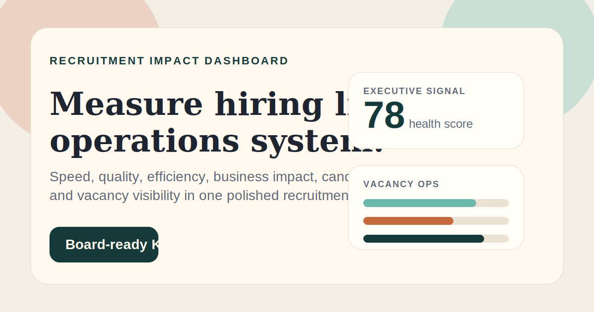
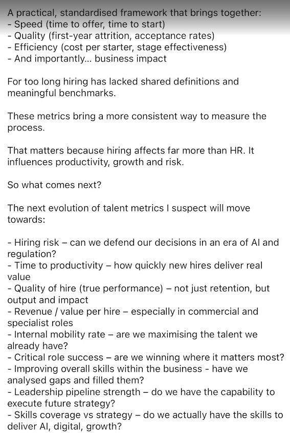

# Recruitment Impact Dashboard

A polished single-page recruitment dashboard concept built from a strategic talent metrics framework.

Live demo:
[recruitment-impact-dashboard.vercel.app](https://recruitment-impact-dashboard.vercel.app)

## What it includes

- Executive recruitment KPIs across speed, quality, efficiency and business impact
- Filters for function, region and hiring priority
- Candidate search across names, roles, stages and skills
- Vacancy operations table for active requisitions and delivery risk
- Sample views for commercial and technology hiring segments
- A clean static frontend built with HTML, CSS and vanilla JavaScript

## Files

- `index.html` - page structure
- `styles.css` - visual design and responsive layout
- `app.js` - dashboard data, filters and candidate search interactions

## Running locally

Open `index.html` in a browser.

## Hosted demo

The dashboard is also deployed as a static Vercel site, which makes it easier to open quickly in interviews, share in applications and use as a clean portfolio link.

## Notes

The dashboard currently uses illustrative sample data so the interface can be reviewed and iterated before connecting to live recruitment sources.
